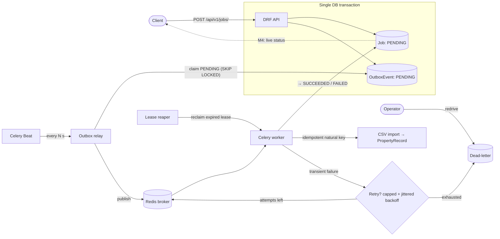

# Foreman

[](https://github.com/edjchapman/foreman/actions/workflows/ci.yml)
[](https://github.com/edjchapman/foreman/actions/workflows/codeql.yml)
[](https://codecov.io/gh/edjchapman/foreman)
[](https://github.com/edjchapman/foreman/releases)
[](LICENSE)
[](pyproject.toml)
[](https://github.com/astral-sh/ruff)
[](https://mypy-lang.org/)
[](https://www.conventionalcommits.org)

**Event-driven job-processing platform** — a property-data import & report-generation service built to demonstrate backend reliability engineering *beyond CRUD*.

A user submits a processing job (e.g. a property/lease CSV import); the API records it atomically and emits a domain event via a **transactional outbox**; **idempotent background workers** process it with **retries** and a **dead-letter** path; the UI streams **live progress over WebSockets** before producing a downloadable report.

> Portfolio learning project. The focus is the *reliability and operability* story — at-least-once delivery, exactly-once *effect*, failure isolation, observability — not feature breadth.

## Status

✅ **Milestone 3 complete (reliability).** Workers are idempotent (exactly-once *effect* via a per-job natural key), retry transient failures with capped, jittered backoff, and dead-letter once attempts are exhausted; a lease + reaper recover a job whose worker died mid-flight, and an operator can `redrive` a dead-lettered job. M1 (submit/track API on PostgreSQL) and M2 (async worker + transactional outbox) are also done. Next: **M4 — realtime UI + observability** (live WebSocket progress, structured logging, runbook). See [ADR 0002](docs/adr/0002-retries-dlq-lease.md).

## Architecture



See [ADR 0001](docs/adr/0001-transactional-outbox.md) (the outbox) and [ADR 0002](docs/adr/0002-retries-dlq-lease.md) (retries, dead-letter, lease + reaper) for the design rationale.

## Stack

Python 3.12 · Django 5 + Django REST Framework · PostgreSQL 16 · Redis + Celery · Django Channels / WebSockets *(M4)* · Docker Compose · pytest · GitHub Actions.

## Quickstart

Full stack with Docker:

```bash
make up          # Django + Postgres; API on http://localhost:8000
```

On the host with uv (no Docker — reads `DATABASE_URL` from your env, see `.env.example`):

```bash
uv sync
make migrate
make test
uv run python manage.py runserver
```

Submit and track a job:

```bash
curl -X POST localhost:8000/api/v1/jobs/ \
  -H 'Content-Type: application/json' \
  -d '{"job_type": "property_csv_import", "payload": {"source": "s3://bucket/sample.csv"}}'

curl localhost:8000/api/v1/jobs/<id>/
curl localhost:8000/healthz
```

The default sample source (`sample:properties.csv`) resolves to a bundled
fixture, so a submitted job runs end-to-end with no external storage. Watch it
move `PENDING → PROCESSING → SUCCEEDED` (with `progress` and an import summary in
`result`). Inline CSV via `payload.csv` also works; remote schemes (`s3://`,
`https://`) are a later milestone.

## API (v1)

| Method | Path | Purpose |
|--------|------|---------|
| `POST` | `/api/v1/jobs/` | Submit a job → `202 Accepted` with id + `Location`. Honours an `Idempotency-Key` header. |
| `GET` | `/api/v1/jobs/{id}/` | Job status, progress, result, error. |
| `GET` | `/api/v1/jobs/` | List jobs (paginated). |
| `GET` | `/healthz` | Liveness + database check. |

A submitted job is recorded `PENDING` together with a transactional-outbox event (one DB transaction). A Celery Beat relay publishes the event to the worker, which ingests the CSV and moves the job to `SUCCEEDED` (or `FAILED`). See [ADR 0001](docs/adr/0001-transactional-outbox.md) for why the outbox sits between submission and dispatch.

## Roadmap

- **M1 — walking skeleton** *(done)*: repo, Docker Compose, `Job` model, submit/track API, health check, tests + CI.
- **M2 — async worker + transactional outbox** *(done)* (Redis + Celery): atomic job+event write, Beat relay, worker ingests the property CSV into `PropertyRecord`. See [ADR 0001](docs/adr/0001-transactional-outbox.md).
- **M3 — reliability** *(done)*: worker-side idempotency (exactly-once effect), retries with backoff, dead-letter, lease-based crash recovery, operator redrive, documented failure modes. See [ADR 0002](docs/adr/0002-retries-dlq-lease.md).
- **M4 — realtime UI + observability**: React/TS + live WebSocket progress (Channels), structured logging, runbook.
- **M5 — ship**: Cypress E2E, deploy + public demo, case study.

## Development

`make help` lists every target; **`make preflight`** runs the full pre-PR gate. CI enforces:

- **`make ci`** — stack gate: ruff lint + format-check, **mypy** (strict), and pytest
  with a **90%** coverage floor, against a PostgreSQL service. Coverage is uploaded to
  **Codecov**.
- **`make check`** — docs/hygiene gate: internal markdown link + anchor validation.
- **`make audit`** — `pip-audit` for dependency CVEs (weekly + on PRs via `audit.yml`).
- **CodeQL** scans the Python code and the workflows; **dependency-review** gates new
  dependencies on every PR.

PR titles follow [Conventional Commits](https://www.conventionalcommits.org) and are
**enforced** by `commit-style` (a required check on `main`). Releases are automated by
**release-please** — merging its Release PR cuts a GitHub Release + tag from the commit
history and publishes a versioned image to **GHCR** (`ghcr.io/edjchapman/foreman`). See
[CONTRIBUTING.md](CONTRIBUTING.md).
